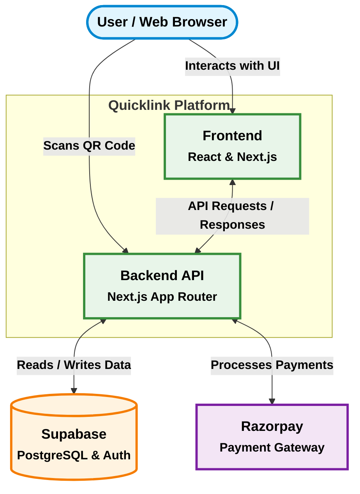

# Simplified Architecture Diagram

Here is a simplified, high-level architecture diagram perfect for including in a project report.

```mermaid
graph TD
    %% Define Styles with Enhanced Visibility
    classDef client fill:#e1f5fe,stroke:#0288d1,stroke-width:3px,color:#000000,font-weight:bold,font-size:18px;
    classDef frontend fill:#e8f5e9,stroke:#388e3c,stroke-width:3px,color:#000000,font-weight:bold,font-size:18px;
    classDef backend fill:#fff3e0,stroke:#f57c00,stroke-width:3px,color:#000000,font-weight:bold,font-size:18px;
    classDef external fill:#f3e5f5,stroke:#7b1fa2,stroke-width:3px,color:#000000,font-weight:bold,font-size:18px;
    classDef edgeLabel font-weight:bold,color:#000000,font-size:16px;

    %% Nodes with Enhanced Text
    User(["<b style='font-size:18px'>User / Web Browser</b>"]):::client
    
    subgraph Quicklink_Platform ["<b style='font-size:18px'>Quicklink Platform</b>"]
        UI["<b style='font-size:18px'>Frontend</b><br/><b style='font-size:16px'>React & Next.js</b>"]:::frontend
        API["<b style='font-size:18px'>Backend API</b><br/><b style='font-size:16px'>Next.js App Router</b>"]:::frontend
    end

    DB[("<b style='font-size:18px'>Supabase</b><br/><b style='font-size:16px'>PostgreSQL & Auth</b>")]:::backend
    Payments["<b style='font-size:18px'>Razorpay</b><br/><b style='font-size:16px'>Payment Gateway</b>"]:::external

    %% Connections with Bold Labels
    User -->|<b style='font-size:16px'>Interacts with UI</b>| UI
    User -->|<b style='font-size:16px'>Scans QR Code</b>| API
    
    UI <-->|<b style='font-size:16px'>API Requests / Responses</b>| API
    
    API <-->|<b style='font-size:16px'>Reads / Writes Data</b>| DB
    API <-->|<b style='font-size:16px'>Processes Payments</b>| Payments
```
